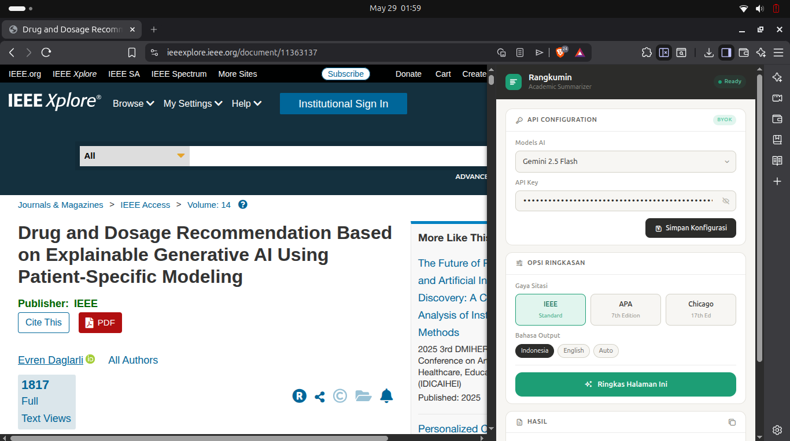

# 📚 Rangkumin - Academic Summarizer



**Rangkumin** is a Manifest V3 Google Chrome extension designed to help students, researchers, and academics instantly extract and summarize scientific journals.

Built with a **BYOK (Bring Your Own Key)** architecture, this extension intelligently scrapes metadata and article content from various academic libraries (such as IEEE Xplore and ScienceDirect), and processes it using your preferred AI model. It generates a structured summary containing the Main Problem, Methodology, and Results, along with a ready-to-use citation.

---

## ✨ Key Features

- **Smart Academic Scraper:** Automated data extraction (Title, Authors, Year, Publisher, Abstract, and Full Text) using a robust and maintainable Selector Dictionary pattern.

- **Bring Your Own Key (BYOK):** Complete freedom to use an API Key from your preferred LLM provider.

- **Multi-Provider Support:** Currently integrated with **Gemini 2.5 Flash** as the primary AI engine, with planned future support for other top-tier models (DeepSeek V4, Groq/Llama 3, OpenAI, Anthropic).

- **Auto-Citation Generator:** Summaries are equipped with ready-to-copy citations formatted in **IEEE, APA, or Chicago** styles.

- **Bilingual Output:** Generate summaries in either Indonesian, English, or Auto-detect mode.

- **Modern Side Panel UI:** A clean, responsive interface integrated seamlessly into your browser's side panel without obstructing the journal page.

---

## 🛠️ Tech Stack

This project is built using standard web technologies focusing on the performance and security of modern Chrome extensions:

- **Core:** HTML5, Vanilla JavaScript (ES6+)
- **Browser API:** Chrome Extension API (Manifest V3, `chrome.sidePanel`, `chrome.storage`, `chrome.tabs`, `chrome.runtime.sendMessage`)
- **Styling:** **Tailwind CSS (via CLI)**
- **Package Manager:** NPM (Node Package Manager)

---

## 📁 Folder Structure

The project separates source files used for development from the clean `src` directory, which is loaded directly into the Chrome engine.

```text
RANGKUMIN/
├── .gitignore
├── LICENSE
├── input.css             # Main input file for Tailwind CSS
├── package-lock.json
├── package.json          # Dependency configuration and scripts
└── src/                  # ⚠️ THIS FOLDER IS LOADED INTO CHROME
    ├── background.js     # Service worker for extension events
    ├── content.js        # Scraper script injected into web pages
    ├── manifest.json     # Core Manifest V3 configuration
    ├── output.css        # Compiled Tailwind CSS file
    ├── sidepanel.html    # Side Panel UI structure
    └── sidepanel.js      # UI interaction logic and AI API calls
```

---

## 🚀 Installation & Setup

To run and develop this extension on your local machine, follow these step-by-step instructions:

### 1. Clone the Repository

Open your terminal and clone this repository:

```bash
git clone [https://github.com/username/rangkumin.git](https://github.com/username/rangkumin.git)
cd rangkumin
```

### 2. Install Dependencies

Make sure you have Node.js installed. Run the following command to install the necessary dependencies (Tailwind CSS):

```bash
npm install
```

### 3. Compile Styles

Make sure you have Node.js installed. Run the following command to install the necessary dependencies (Tailwind CSS):

```bash
npx tailwindcss -i ./input.css -o ./src/output.css --watch
```

(Note: Keep this terminal process running in the background while you are developing or modifying styles).

### 4. Load the Extension into Chrome

1. Open Google Chrome.
2. Type **chrome://extensions/** in the address bar and press Enter.
3. Turn on Developer mode using the toggle switch in the top right corner.
4. Click the Load unpacked button in the top left corner.
5. Navigate to your project directory and select the **src** folder.
6. The Rangkumin extension is now installed and ready to use!

---

## 💡 How to Use

1. Open a scientific journal page (right now compatible with IEEE Xplore).
2. Click the Rangkumin extension icon in your Chrome toolbar to open the Side Panel.
3. Enter your API Key in the configuration menu and click Save.
4. Select your preferred citation style and output language.
5. Click the **Summarize Ringkas Halaman Ini** (Summarize This Page) button.

---

## 🔒 Privacy & Security (API Key Usage)

**Your Data, Your Keys:** Rangkumin is designed with strict privacy in mind. Your API Keys are stored locally and securely within your browser using Google Chrome's native `chrome.storage.local` API.

We **do not** collect, track, store, or transmit your API Keys to any third-party databases or our own servers. Your keys are used exclusively on the client side to communicate directly with your chosen LLM provider (e.g., Google, OpenAI, DeepSeek, Anthropic, or Groq). You have full control and can easily overwrite or remove your keys at any time through the Side Panel.

---

## 🤝 Open Source & Contributing

Rangkumin is proudly open-source and built for the community! We believe in collaborative development to make academic research easier and more accessible for everyone.

Whether you want to add support for a new LLM provider, improve the scraping logic for a specific journal site, or fix a bug, your contributions are highly welcome.

**How to contribute:**

1. Fork the Project
2. Create your Feature Branch (`git checkout -b feature/AmazingFeature`)
3. Commit your Changes (`git commit -m 'feat: add some AmazingFeature'`)
4. Push to the Branch (`git push origin feature/AmazingFeature`)
5. Open a Pull Request

If you have a suggestion or found a bug, feel free to open an **Issue** in this repository.

---

# 📄 License

This project is licensed under the **MIT License** - see the [LICENSE](LICENSE) file for details.

---

_Developed by [Muhammad Afiffudin Al Mahdi](https://pipuyy.vercel.app/) — Politeknik Negeri Batam (Polibatam)_
